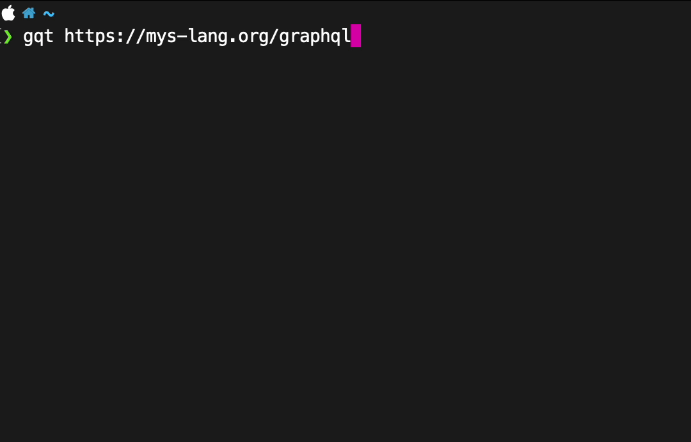

GraphQL in the terminal
=======================

Ideas
-----

- Save latest query and cursor position in ``~/.cache/gqt.toml``.

- Execute or print built query.

- Contols:

  - Execute built query when pressing ``<Enter>``.

  - Toggle checkbox with ``<Space>``.

  - Use arrows ro navigate.

  - Use ``/`` to fuzzy find field.

- Query all selected visible leaves.

- Variables?
