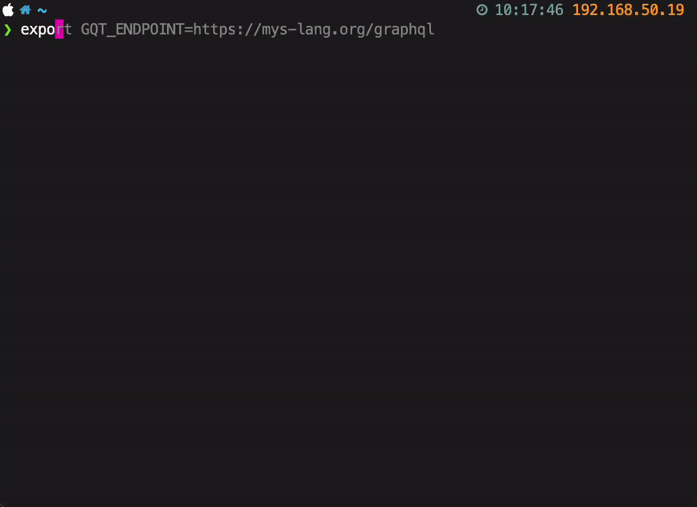

GraphQL in the terminal
=======================

Installation
------------

.. code-block:: text

   pip3 install gqt
           
Ideas
-----

- Print built query instead of executing it.

- Contols:

  - Use ``/`` to fuzzy find field.

- Variables?
